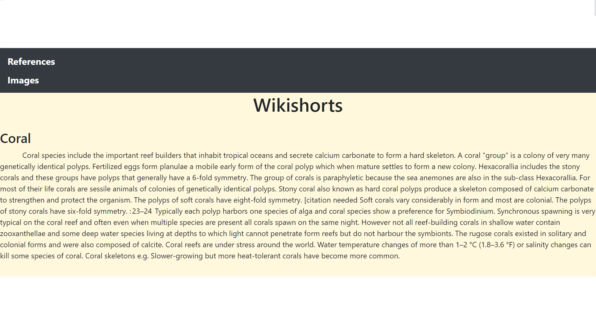
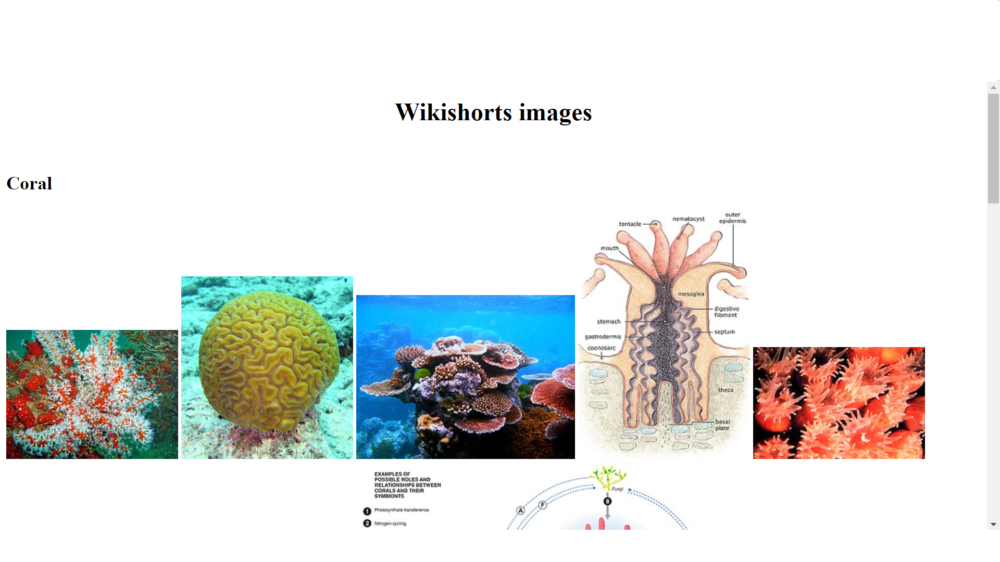
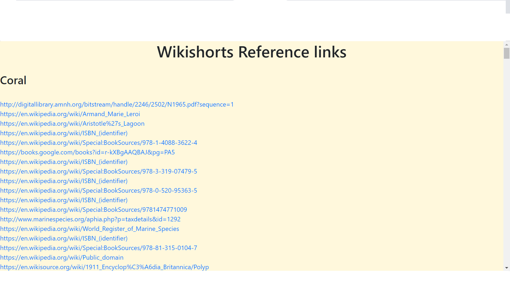

# Wikishorts

The 'wikishorts' is a shorter version of wikipedia. We generally search wikipedia to get information on the particular topic, but it takes too long to read completely, but wikishorts solves this problem by scraping the data from the wikipedia, it summarizes the text and displays the information in brief and in precise manner, thus taking less amount of time to read. wikishorts also scraps the links of references and images from wikipedia and displays them in an easy accessible way.

## Deployment link

https://wikiscrapper.herokuapp.com/

## 💻 Tools Used

- Flask
- MongoDB
- Selenium
- Beautifulsoup
- Python
- Heroku
- PyCharm

## Project capabilities

☑️ Gets the input article name from user, searches for the same using selenium, if search is ambiguous, selects the top suggestion. 

☑️ Gives a short summary of the article using pysummarize library, stores the same in mongo DB database, this is done in order to skip scrapping, if the same input is searched repeatedly.

☑️ If information such as reference links and images is required for the article, it scrapes from Wikipedia, stores it in a database, and displays the result in a webpage. 

☑️ The images are stored in the database as base64. 

## Results

☑️ It saves time for the readers by reading the summarized data rather than the whole wikipedia page.

☑️ Only when needed the image and reference section is used, thus giving an option to readers.

## Screenshots

